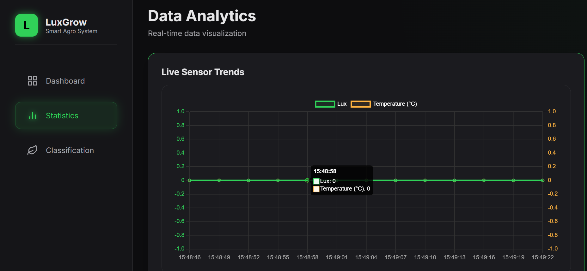

# LuxGrow – Smart Agro System Dashboard

LuxGrow adalah dashboard Smart Agriculture berbasis IoT yang digunakan untuk memantau dan mengontrol kondisi lingkungan tanaman secara real-time. Sistem ini membantu pengguna dalam menjaga kondisi pertumbuhan tanaman tetap optimal berdasarkan data intensitas cahaya (Lux), suhu (°C), dan kelembapan (%).

---
## Preview Dashboard

## Preview Statistics

## Preview Classification

## Deskripsi Sistem

LuxGrow terdiri dari:

- Sensor cahaya (Lux)
- Sensor suhu
- Sensor kelembapan
- Raspberry Pi sebagai pengolah data dan pengirim data ke server
- Web dashboard untuk monitoring dan kontrol

Sistem membaca data sensor secara real-time, menampilkan visualisasi data, serta melakukan klasifikasi kondisi tanaman untuk memberikan rekomendasi atau tindakan otomatis.

---

## Fitur Utama

### 1. Live Overview (Dashboard)
Halaman utama untuk monitoring real-time:
- Light Intensity (Lux)
- Temperature (°C)
- Humidity (%)
- Servo Control
  - Mode Automatic / Manual
  - Monitoring sudut servo (0°–180°)
  - Kontrol buka/tutup peneduh

---

### 2. Data Analytics (Statistics)
- Visualisasi grafik tren Lux dan Temperature
- Monitoring perubahan data berdasarkan waktu
- Membantu analisis pola lingkungan tanaman

---

### 3. Intelligent Classification
Sistem klasifikasi otomatis berdasarkan data sensor:
- Cahaya terlalu tinggi
- Cahaya terlalu rendah
- Kondisi optimal

Hasil klasifikasi digunakan untuk menentukan tindakan seperti menggerakkan servo peneduh.

---

## Cara Kerja Sistem

1. Sensor membaca data lingkungan.
2. Raspberry Pi menerima dan memproses data.
3. Data dikirim ke server / database secara real-time.
4. Dashboard menampilkan:
   - Nilai sensor
   - Grafik tren
   - Hasil klasifikasi kondisi
5. Jika diperlukan, sistem mengaktifkan servo untuk menyesuaikan kondisi cahaya.

---

## Struktur Menu Dashboard

- Dashboard  
  Monitoring real-time dan kontrol servo.

- Statistics  
  Grafik visualisasi data sensor.

- Classification  
  Analisis kondisi tanaman dan rekomendasi sistem.

---

## Contoh Logika Otomatis

- Jika Lux > batas maksimum → Servo menutup peneduh.
- Jika Lux < batas minimum → Servo membuka peneduh.
- Jika suhu tinggi → Sistem memberikan peringatan.
- Jika kelembapan rendah → Sistem merekomendasikan penyiraman.

---

## Teknologi yang Digunakan

- Raspberry Pi
- Sensor Light (Lux)
- Sensor Temperature & Humidity
- Web-based Dashboard
- Real-time data communication (HTTP / MQTT)

---

## Tujuan Sistem

- Meningkatkan efisiensi pertumbuhan tanaman
- Mengurangi kontrol manual
- Mendukung sistem pertanian berbasis IoT
- Memberikan keputusan berbasis data secara otomatis

---

## Lisensi

Project ini dikembangkan untuk tujuan edukasi dan pengembangan sistem Smart Agriculture.
